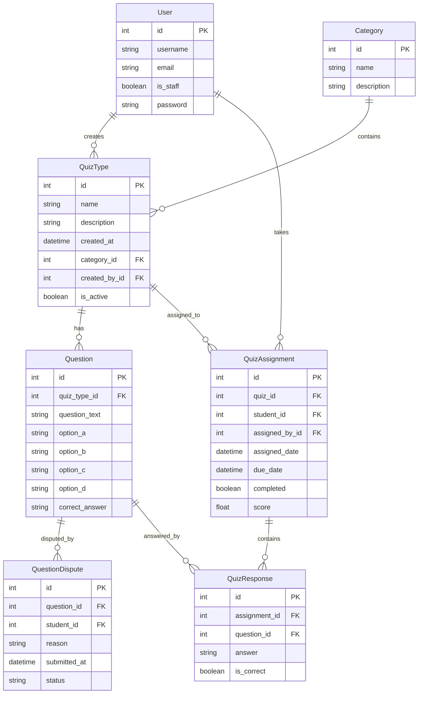

# Relazione Tecnica QuizLand - Sistema di Gestione Quiz Online

## Indice


1. [Introduzione](#1-introduzione)
2. [Analisi dei Requisiti](#2-analisi-dei-requisiti)
3. [Progettazione](#3-progettazione)
4. [Tecnologie Utilizzate](#4-tecnologie-utilizzate)
5. [Implementazione](#5-implementazione)
6. [Test e Validazione](#6-test-e-validazione)
7. [Risultati e Screenshot](#7-risultati-e-screenshot)
8. [Problemi e Soluzioni](#8-problemi-e-soluzioni)
9. [Conclusioni](#9-conclusioni)

---


## 1. Introduzione

**QuizLand** è un’applicazione web progettata per la gestione di quiz online, con l’obiettivo di facilitare l’interazione tra professori e studenti attraverso un sistema intuitivo e accessibile. La piattaforma consente ai **professori** di creare, gestire e monitorare quiz, mentre gli **studenti** possono completare i quiz assegnati, visualizzare i risultati e contestare eventuali domande ambigue. L’applicazione si propone di offrire un ambiente dinamico ed efficace per la valutazione delle competenze, fornendo strumenti avanzati di gestione e analisi delle performance degli studenti.

### 1.1 Obiettivi del Progetto

Il progetto **QuizLand** mira a semplificare la gestione dei quiz, permettendo ai professori di creare, modificare ed eliminare quiz e domande in modo intuitivo. Inoltre, facilita l’assegnazione e la valutazione delle prove, automatizzando il processo di correzione e fornendo un feedback immediato agli studenti. L'applicazione fornisce statistiche dettagliate sui risultati dei quiz, sia per i singoli studenti che per intere classi, permettendo ai professori di monitorare il progresso degli studenti. Infine, include un sistema di contestazione che consente agli studenti di segnalare domande poco chiare o errate, con gestione riservata ai professori. L'interfaccia è moderna, responsive e facile da navigare, garantendo una user experience ottimale.

## 2. Analisi dei Requisiti

L’applicazione prevede due tipologie di utenti: **professori (amministratori)** e **studenti (utenti registrati)**.

### Professori (Amministratori)
I professori hanno accesso a funzionalità avanzate per la gestione dei quiz. Possono creare, modificare ed eliminare quiz, gestire le domande e le risposte, e assegnare i quiz agli studenti. Inoltre, possono visualizzare statistiche dettagliate sui risultati dei quiz, come il punteggio medio della classe o le domande con una percentuale di errore elevata. Infine, i professori possono gestire le contestazioni sollevate dagli studenti, risolvendole o respingendole.

### Studenti (Utenti Registrati)
Gli studenti possono visualizzare l’elenco dei quiz disponibili e partecipare ai quiz con un timer integrato per la scadenza delle risposte. Dopo aver completato un quiz, possono visualizzare immediatamente i risultati e le risposte corrette. In caso di dubbi, hanno la possibilità di contestare domande specifiche, avviando una discussione gestita dai professori. Inoltre, gli studenti possono accedere alla cronologia dei tentativi effettuati e ai punteggi ottenuti, monitorando il proprio progresso nel tempo.

### Diagramma dei Casi d’Uso
Il diagramma dei casi d’uso illustra le interazioni tra i professori e gli studenti con il sistema. I professori possono creare quiz, gestire domande e visualizzare statistiche, mentre gli studenti possono completare quiz, visualizzare risultati e contestare domande.


---


## 3. Progettazione

### 3.1 Architettura del Sistema
Il sistema utilizza il pattern architetturale **MVC (Model-View-Controller)** implementato attraverso Django. I **Models** (`models.py`) definiscono la struttura dei dati, le **Views** (`views.py`) gestiscono la logica di business e recuperano i dati da inviare ai template, mentre i **Templates** (`template.html`) rappresentano l'interfaccia utente. Questo approccio migliora la modularità e la manutenibilità del codice.

### Pattern Architetturale MVC/MVT:

#### Models (`models.py`)

I modelli definiscono la struttura dati principale:

- `QuizType`: Tipologie di quiz
- `Question`: Domande con opzioni multiple
- `QuizAssignment`: Assegnazione quiz agli studenti
- `QuizResponse`: Tracciamento risposte
- `QuestionDispute`: Gestione contestazioni

#### Views (`views.py`)

Gestisce la logica di business:

- Autenticazione e autorizzazione utenti
- Flusso quiz: assegnazione, svolgimento, valutazione
- Elaborazione risposte e calcolo punteggi
- Gestione contestazioni

#### Templates (`templates/`)

L'interfaccia utente è sviluppata con Bootstrap 5:

- Dashboard per studenti e docenti
- Form interattivi per quiz e contestazioni
- Visualizzazione risultati e statistiche


### 3.2 Schema del Database (Diagramma ER)
Il diagramma mostra le relazioni tra i modelli principali: **Category**, **QuizType**, **Question**, **QuizAssignment** e **QuestionDispute**. Ogni classe ha campi e metodi specifici per gestire le operazioni relative ai quiz, alle domande e alle contestazioni. Inoltre vediamo le chiavi primarie (PK) e esterne (FK) nel database che riflettono le relazioni tra le tabelle del DB.

### Gestione Utenti

```python
class User(AbstractUser):
    is_teacher = models.BooleanField(default=False)
    is_student = models.BooleanField(default=True)
```

### Sistema Quiz

```python
class QuizType:
    name = models.CharField(max_length=200)
    description = models.TextField()
    category = models.ForeignKey(Category)
    created_by = models.ForeignKey(User)
```

### Gestione Domande

```python
class Question:
    quiz_type = models.ForeignKey(QuizType)
    question_text = models.TextField()
    options = [option_a, option_b, option_c, option_d]
    correct_answer = models.CharField()
```

### Sistema di Valutazione

```python
class QuizResponse:
    assignment = models.ForeignKey(QuizAssignment)
    question = models.ForeignKey(Question)
    answer = models.CharField()
    is_correct = models.BooleanField()
```

### Flusso di dati

Il docente seleziona il quiz e gli studenti. Il sistema crea un `QuizAssignment` e notifica gli studenti. Lo studente accede al quiz assegnato, risponde alle domande e il sistema salva le risposte in `QuizResponse`, calcolando automaticamente il punteggio. Lo studente invia una contestazione, il docente riceve la notifica, valuta e aggiorna i punteggi se necessario. L'accesso è gestito tramite login, sessioni Django e protezione CSRF.




## 4. Tecnologie Utilizzate

### 4.1 Backend
- **Django 4.2**: Framework Python per lo sviluppo web.
- **SQLite**: Database relazionale leggero e integrato.
- **Python 3.9+**: Linguaggio di programmazione principale.

### 4.2 Frontend
- **Bootstrap 5**: Framework CSS per l’interfaccia responsive.
- **JavaScript**: Per interazioni lato client.
- **Font Awesome**: Per le icone.
- **HTML5/CSS3**: Per la struttura e lo stile.

---

## 5. Implementazione

### 5.1 Struttura del Progetto
La struttura del progetto è organizzata in modo modulare, con una chiara separazione tra modelli, viste, template e file statici. I modelli definiscono la struttura del database, mentre le viste gestiscono la logica dell'applicazione. I template sono responsabili della visualizzazione dei dati, e i file statici includono fogli di stile, script e immagini.


#### Modelli principali:

```python
class QuizType(models.Model):
    name = models.CharField(max_length=200)
    description = models.TextField()
    created_by = models.ForeignKey(User, on_delete=models.CASCADE)
    created_at = models.DateTimeField(auto_now_add=True)

class Question(models.Model):
    quiz_type = models.ForeignKey(QuizType, on_delete=models.CASCADE)
    question_text = models.TextField()
    option_a = models.CharField(max_length=200)
    option_b = models.CharField(max_length=200)
    option_c = models.CharField(max_length=200)
    option_d = models.CharField(max_length=200)
    correct_answer = models.CharField(max_length=1, choices=ANSWER_CHOICES)
```

---

## 6. Test e Validazione

### 1. **Test Creazione Quiz (test_quiz_creation)**

```python
def test_quiz_creation(self):
        """
        TEST 1: Creazione Quiz
        Verifica che un quiz venga creato correttamente con tutti i suoi attributi.
        Screenshot: quiz_creation_test.png
        - Mostra la creazione di un nuovo quiz
        - Verifica dei campi nel database
        """
        new_quiz = QuizType.objects.create(
            name='Nuovo Quiz',
            description='Descrizione test',
            category=self.category,
            created_by=self.teacher
        )
        self.assertEqual(new_quiz.name, 'Nuovo Quiz')
        self.assertEqual(new_quiz.created_by, self.teacher)
        self.assertTrue(QuizType.objects.filter(name='Nuovo Quiz').exists())
```

- Verifica la corretta creazione di un nuovo quiz nel sistema

- Controlla che tutti i campi vengano salvati correttamente
- Assicura che il quiz sia associato al professore corretto

### 2. **Test Assegnazione Quiz (test_quiz_assignment)**

```python
def test_quiz_assignment(self):
        """
        TEST 2: Assegnazione Quiz
        Verifica il processo di assegnazione di un quiz a uno studente.
        Screenshot: quiz_assignment_test.png
        - Mostra l'assegnazione del quiz
        - Verifica dello stato iniziale (non completato)
        - Verifica del completamento e del punteggio
        """
        # Verifica creazione corretta dell'assignment
        self.assertEqual(self.assignment.quiz, self.quiz)
        self.assertEqual(self.assignment.student, self.student)
        self.assertEqual(self.assignment.assigned_by, self.teacher)
        self.assertFalse(self.assignment.completed)
        self.assignment.completed = True # Simula completamento quiz
        self.assignment.score = 7.5
        self.assignment.save()
        self.assertTrue(self.assignment.completed)# Verifica completamento
        self.assertEqual(self.assignment.score, 7.5)
```

- Verifica il processo di assegnazione di un quiz a uno studente
- Controlla lo stato iniziale dell'assegnazione (non completato)
- Verifica il corretto salvataggio del punteggio dopo il completamento

### 3. **Test Permessi di Accesso (test_quiz_access_permissions)**

```python
def test_quiz_access_permissions(self):
        """
        TEST 3: Permessi di Accesso
        Verifica i permessi di accesso al quiz per diversi tipi di utenti.
        
        Screenshot: quiz_permissions_test.png
        - Accesso come studente autorizzato
        - Tentativo di accesso non autorizzato
        - Tentativo di accesso come altro studente
        """
        # Test accesso studente autorizzato
        self.client.login(username='student1', password='test123')
        response = self.client.get(
            reverse('quizapp:quiz_detail', args=[self.assignment.id])
        )
        self.assertEqual(response.status_code, 200)
        
        # Test accesso non autorizzato (non loggato)
        self.client.logout()
        response = self.client.get(
            reverse('quizapp:quiz_detail', args=[self.assignment.id])
        )
        self.assertEqual(response.status_code, 302)  # Redirect al login
        
        # Test accesso altro studente (non autorizzato)
        other_student = User.objects.create_user(
            username='student2',
            password='test123'
        )
        self.client.login(username='student2', password='test123')
        response = self.client.get(
            reverse('quizapp:quiz_detail', args=[self.assignment.id])
        )
        self.assertEqual(response.status_code, 403)  # Forbidden

```

- Verifica che solo gli studenti autorizzati possano accedere al quiz
- Controlla il redirect al login per utenti non autenticati
- Verifica che altri studenti non possano accedere ai quiz non assegnati a loro

### 4. **Test Contenuto Quiz (*test_quiz_content*)**

```python
def test_quiz_content(self):
        """
        TEST 4: Contenuto Quiz
        Verifica che il contenuto del quiz sia visualizzato correttamente.
        
        Screenshot: quiz_content_test.png
        - Verifica presenza domande
        - Verifica opzioni di risposta
        - Verifica layout della pagina
        """
        self.client.login(username='student1', password='test123')
        response = self.client.get(
            reverse('quizapp:quiz_detail', args=[self.assignment.id])
        )
        
        # Verifica presenza domande nel contesto
        self.assertIn('questions', response.context)
        questions = response.context['questions']
        self.assertEqual(questions.count(), 2)
        
        # Verifica contenuto della pagina
        self.assertContains(response, 'Domanda 1')
        self.assertContains(response, 'Domanda 2')
        self.assertContains(response, 'option_a')
        self.assertContains(response, 'option_b')
```

- Verifica la corretta visualizzazione delle domande
- Controlla la presenza di tutte le opzioni di risposta
- Assicura che il layout della pagina sia corretto

### **Come eseguire i test**

Per eseguire l'intera suite: `python manage.py test quizapp`

Per un test specifico: `python manage.py test quizapp.tests.QuizTests.test_quiz_creation`

Per un output dettagliato: `python manage.py test quizapp -v 2`

Ricordati che i test utilizzano un database separato di test che viene creato e distrutto automaticamente durante l'esecuzione dei test.
Per vedere i test in azione nel database principale, dobbiamo:
eseguiamo lo script:

```shell
python manage.py shell
\>>> from setup_demo import setup_demo_data
\>>> setup_demo_data()
```

---

## 7. Risultati e Screenshot

### Interfaccia Utente anonimo


### Interfaccia Professore
L'interfaccia professore include una dashboard con una panoramica completa delle funzionalità disponibili, come la creazione e gestione dei quiz, la visualizzazione delle statistiche e la gestione delle contestazioni. La creazione di un nuovo quiz è intuitiva, con un form che include un editor di testo avanzato e la possibilità di selezionare una categoria.


**Creazione Quiz**: I professori possono creare quiz con domande multiple choice


**Aggiungi domanda**


**Gestione delle domande:**


**Assegnazione**: Sistema flessibile di assegnazione agli studenti


**Valutazione/Statistiche**: Calcolo automatico dei punteggi in decimi


**Gestisci le contestazioni:**


### Interfaccia Studente

L'interfaccia studente presenta una dashboard con i quiz assegnati, le scadenze e i risultati dei quiz completati. Gli studenti possono partecipare ai quiz, visualizzare i risultati e contestare domande specifiche.


**Fare quiz assegnati dal professore**:


**Revisionare le risposte e contestare le risposte**


---

## 8. Problemi e Soluzioni

### 8.0 Gestione degli Utenti

**Problema**: Distinzione tra professori e studenti
**Soluzione**: Implementato attraverso il sistema di permessi Django:

```python
<-- quizland/quizapp/views.py
# Definizione della funzione is_teacher all'inizio del file
def is_teacher(user):
    """
    Verifica se un utente è un insegnante (staff)
    """
    return user.is_staff
```

### 8.1 Gestione delle Contestazioni
Una delle principali sfide è stata la gestione delle contestazioni. Per risolvere questo problema, è stato implementato un sistema che permette agli studenti di contestare domande e ai professori di risolverle, tracciando lo stato e le note di risoluzione.

### 8.2 Calcolo del Punteggio
Un'altra sfida è stata garantire che il punteggio fosse calcolato correttamente e memorizzato in modo sicuro, soprattutto in caso di più tentativi. La soluzione è stata l'implementazione di un sistema di calcolo del punteggio basato sulle risposte corrette e la memorizzazione del punteggio nel campo `score` del modello `QuizAssignment`.

```python
        <-- quizland/quizapp/views.py
        total_questions = questions.count()
        score = (correct_answers / total_questions) * 10 if total_questions > 0 else 0
        score_percentage = (correct_answers / total_questions) * 100 if total_questions > 0 else 0

        # Aggiorna il punteggio nell'assegnazione se non è già stato fatto
        if assignment.score is None:
            assignment.score = score
            assignment.save()
```


## 9. Conclusioni

### 9.1 Obiettivi Raggiunti
Il progetto **QuizLand** ha raggiunto con successo i suoi obiettivi principali, fornendo un sistema completo per la gestione dei quiz online. L'applicazione è stata progettata per essere intuitiva e accessibile, con funzionalità avanzate per professori e studenti.

- Sistema completo di gestione quiz
- Interfaccia user-friendly
- Statistiche dettagliate
  Le statistiche forniscono informazioni dettagliate sulle performance:
- Sistema di contestazione domande

### 9.2 Sviluppi Futuri
Tra gli sviluppi futuri pianificati ci sono l'implementazione di un sistema di backup automatico, l'integrazione di un'API REST per l'interoperabilità con altri sistemi e l'aggiunta di funzionalità avanzate di analisi dei dati.
Come indicato nel README:

```markdown
## **Feature aggiuntive (future)**
1. **Quiz personalizzati**:
    Gli utenti potranno creare quiz personalizzati e condividerli con altri utenti.
2. **Sistema di raccomandazione**:
    Suggerimenti di quiz basati sui risultati e sugli interessi degli utenti.
3. **Statistiche avanzate**:
    Dashboard per amministratori con dati dettagliati sulle performance degli utenti.
4. **Supporto multilingua**:
    Localizzazione dell'applicazione in più lingue.
```

### 9.3 Considerazioni Finali
Il progetto ha dimostrato che un approccio modulare e ben strutturato può portare a un'applicazione robusta e scalabile. La combinazione di Django per il backend e Bootstrap per il frontend ha permesso di creare un sistema efficiente e di facile utilizzo.

Il progetto dimostra una solida architettura Django con:

- Separazione chiara dei ruoli (MVC)
- Sistema di permessi robusto
- Gestione efficiente del database
- Interfaccia responsive con Bootstrap